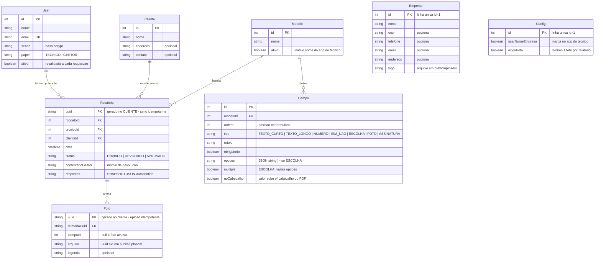

# Mapa do banco de dados — EmCampo

Banco: **SQLite** (arquivo `prisma/dev.db`), acessado via **Prisma** (`prisma/schema.prisma`).
SQLite não tem enum — papéis, tipos e status são strings **validadas na aplicação**.

## Diagrama

## Decisões de projeto (o porquê do desenho)

1. **`Relatorio.respostas` é um snapshot JSON** — array `[{campoId, rotulo, tipo, valor, obs, cab}]`
   congelado no momento do preenchimento. O gestor pode editar/remover campos do modelo à vontade:
   relatórios antigos nunca quebram nem mudam. Por isso `Relatorio` **não** tem tabela de respostas
   normalizada — é decisão deliberada, não dívida.
   - `valor`: string | number | boolean | string[] (escolha múltipla) | null
   - `obs`: observação livre do técnico sobre o item
   - `cab`: se o campo estava marcado "no cabeçalho" na época
   - Assinatura: dataURL `data:image/png;base64,...` (validado no servidor, máx. 200KB)
2. **Chaves `uuid` geradas no cliente** (`Relatorio.uuid`, `Foto.uuid`) — o app offline cria o
   relatório sem falar com o servidor; o reenvio (queda de sinal, retry) faz *upsert* e nunca
   duplica. É o alicerce do sync offline.
3. **Fotos ficam no disco** (`public/uploads/<uuid>.<ext>`), só o nome vai ao banco. Servidas por
   rota autenticada `/uploads/[nome]` (gestor vê todas; técnico só as dos próprios relatórios;
   logo é visível a qualquer logado).
4. **`Empresa` e `Config` são linhas únicas (id=1)** — dados da prestadora e parametrizações.
   Simples de ler em qualquer página; vira tabela multi-linha se um dia houver multi-tenant.
5. **Status do relatório** anda só para frente: `ENVIADO → DEVOLVIDO → ENVIADO → APROVADO`.
   `APROVADO` é imutável (o servidor rejeita alteração com 409). Rascunho **não existe no banco**
   — vive só no IndexedDB do aparelho até o envio.
6. **Cascatas**: apagar `Modelo` remove os `Campo`s (relatórios sobrevivem pelo snapshot);
   apagar `Relatorio` remove as `Foto`s do banco (arquivo físico fica — limpeza pendente, ver
   retenção/LGPD no roadmap).

## Evolução planejada

| Quando | Mudança |
|---|---|
| Primeiro deploy comercial | SQLite → **Postgres** (trocar `datasource` no schema; Prisma abstrai o resto) |
| Fotos em escala | `public/uploads/` → storage S3/R2 (muda só a gravação/leitura do arquivo) |
| Multi-tenant (SaaS) | `empresaId` em User/Cliente/Modelo/Relatorio + `Empresa`/`Config` multi-linha + isolamento por tenant em toda query |
| Auditoria corporativa | tabela `Evento` (quem fez o quê e quando) — hoje o histórico se limita ao status |
